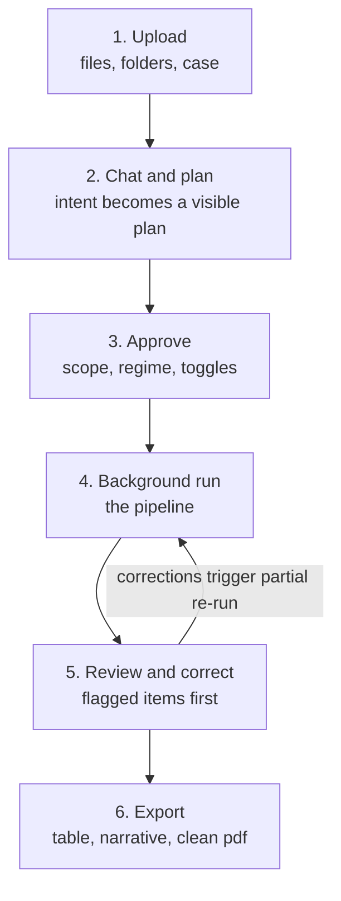
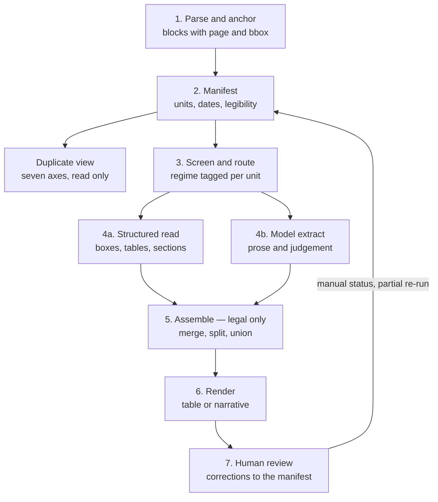
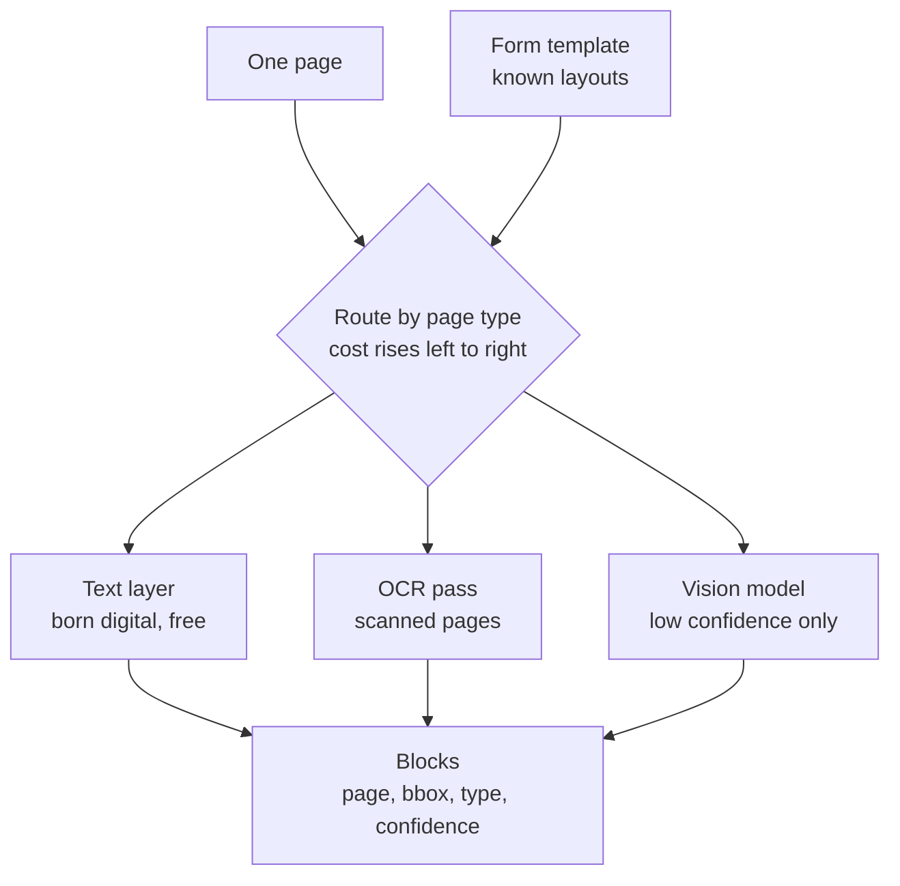
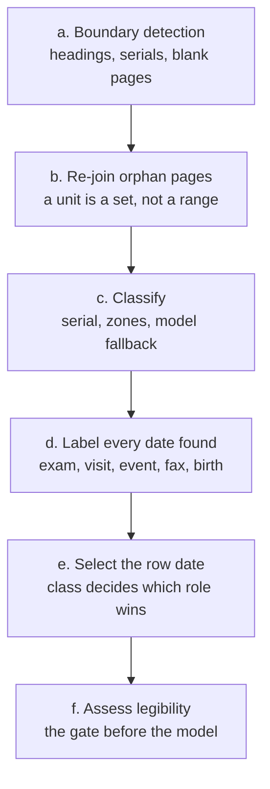
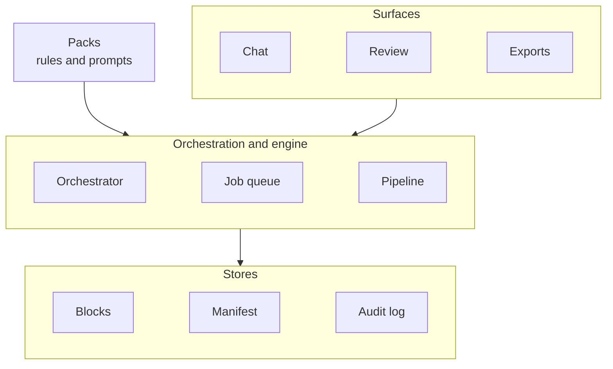

# ALIE — Product Requirements Document

**Medico-legal document understanding for Quebec compensation regimes.**
Status: draft for build · Scope: local, complete build · Owner: Uzziel

**This is not an MVP.** Every feature described here gets built. Features that are not yet
proven ship **off by default**, behind a flag, each paired with the metric that decides
whether it earns its place (§9.2). Phases in §14 are **build order**, not scope reduction.

> Companions: `cnnest_PARALEGAL-EXTRACTION-FRAMEWORK.md`, `Extraction Methodology SAAQ`,
> `Extraction Methodology IVAC`. Those documents are the **source of truth for extraction
> rules**. This PRD is the source of truth for **architecture**. Where they conflict on a
> rule, they win; where they conflict on structure, this does.

---

## 1. What we are building

A document-understanding engine for medico-legal files, with two products on one core.

The core ingests PDFs — one report or a 3000-page bundle — and produces a **manifest**:
every report unit in the file, its class, its author, the clinical event date (correctly
selected from the six dates printed on the page), how legible it is, and where every fact
lives down to the page and bounding box. Nothing is dropped; missing information is a
**status**, not an absence.

Two products render from that manifest:

| Vertical | User | Deliverable |
|---|---|---|
| **Legal** | paralegal, lawyer | tabular medical chronology, French clinical shorthand, one row per encounter, every row cited |
| **Health** | clinician | narrative draft report, every sentence cited |

### 1.1 The commitment that shapes everything

From the CNESST framework, PART 0:

> She does **not** summarise. She **transcribes selected lines** into a fixed row shape.

An app built as "summarise this medical document" produces output the firm would not
recognise as its work. Therefore the model never writes a row. **It fills a schema, with
character offsets into a specific page, and code renders the row.** That is what makes the
output testable against an answer key and auditable by the firm.

### 1.2 Non-goals for v1

Not building: hosting/cloud deployment, authentication, multi-tenancy, PHI compliance
controls, knowledge graph, vector retrieval, mobile. Each is addressed in §14 or §15.

---

## 2. Vocabulary

These four words are not synonyms. Most design errors come from conflating them.

| Term | Definition |
|---|---|
| **File / bundle** | one uploaded PDF. `Médical pdf 71572-1.pdf` is 139 pages. |
| **Block** | one parsed element on one page: heading, paragraph, table, checkbox, signature, handwriting, page label. Carries page + bbox. |
| **Report unit** | one logical report — a physio note, an IRM report, a CNESST form. **A set of pages, not a range.** |
| **Encounter** | report units produced by one clinician in one sitting. |
| **Row** | one line of the chronology. Usually one encounter; diagnostic studies split back out. |

A 600-page upload becomes roughly 200 report units and fans out to 200 parallel
extractions. The extractor's unit is the **report unit**, never the file.

---

## 3. Design principles

1. **The manifest is the product.** The chronology and the narrative report are
   projections of it. So is the duplicate view, and so is anything built later.
2. **The model fills schemas; code renders output.** No `write_row` tool exists.
3. **Deterministic first.** Structured reads (checkboxes, tables, numbered sections) run
   before the model. The model handles only prose and judgement.
4. **Nothing is dropped.** Undated, illegible, excluded and zero-content units all reach
   the manifest and the coverage report with a status.
5. **Every string is cited.** An uncited string is a validation failure, not a warning.
6. **Regimes are data, not branches.** The engine contains zero regime knowledge.
7. **Corrections go to the manifest, not the output.** That is what makes runs repeatable.
8. **Stages are pure and idempotent.** Ids in, stores read, stores written. This is what
   makes cloud migration a deployment detail (§13.4).

---

## 4. Architecture

### 4.1 End-to-end user journey



**Upload** — files land in a case with a folder label (`Médical`, `CHUM`, `TAT`). The label
becomes the locator name in column 2; it is not cosmetic. Parse starts immediately.

**Chat and plan** — a request produces a *plan*, not an answer:

> 142 report units across 4 bundles · regime CNESST, 3 units flagged as a possible SAAQ
> track · 11 duplicate candidates · billing and consent excluded by rule · est. 6 min

The plan is the manifest summary in readable form. It is the first moment a scoping error
can be caught, before cost is spent.

**Approve** — toggles resolve here (§9). Approval converts a plan into a job.

**Background run** — the user may close the tab. Progress is per stage; partial output is
visible as it lands.

**Review and correct** — §10.

**Export** — chronology, narrative report, and a **deduplicated PDF**. The last is a real
deliverable: from the 2026-06-11 walkthrough, a 100-page file with nine duplicate pages
removed, downloadable as a clean 91-page document.

### 4.2 Pipeline



Deterministic: 1, 2 (except classifier fallback), 3, 4a, 5, 6, and all validation.
Model: 4b, the classifier fallback, the adjudicator, and the health narrative composer.

**4a runs before 4b, and 4b fills only what remains.** On a REM, 4a produces the eight
barème rows with codes and percentages, the consolidation date and the `[x] Oui` on
permanent impairment. 4b handles the LF wording, the named pre-injury trade, the diagnosis
compression.

Three consequences:

- Cost collapses on the highest-value, highest-frequency, most template-stable class.
- Verification improves: a checkbox read cites a **bounding box and a crop image**.
- A conflict detector appears free — when 4a says `[x] Non` and 4b extracts "atteinte
  permanente reconnue", that is a high-signal flag neither path catches alone.

### 4.3 Parse layer

We do not use a commercial parser API. We adopt the **output contract** of one and reject
the approach: a general parser must handle any document with no priors. We have ~15
recurring form types across three regimes. That asymmetry is the cost advantage.



**Blocks are the truth; markdown is a rendering of blocks.** Commercial markdown output
loses page boundaries entirely, which is fatal when column 2 is a page locator.

Adopted markup vocabulary: `[x]` / `[ ]`, `<signature>`, `<empty>`, `<b>` `<i>` `<u>`,
tables, heading hierarchy. `<empty>` is load-bearing — it distinguishes *field present but
blank* from *field absent*, which is exactly the three-state consolidation / four-state
APIPP distinction.

Three block types added beyond that vocabulary:

- **`handwriting`** — detected, never merged into body text. Reference output contained
  `→ à valider ensuite / mais je crois que oui` inline after two `[x] Oui` determinations.
  That is a reviewer's private note leaking into a document destined for opposing counsel.
  We **detect** handwriting regions; we do not attempt recognition.
- **`page_label`** — the printed `p. 3 de 4` / EMR stamp (§8.1).
- **`stamp`** — fax banners and mailroom marks, isolated for the dedupe transmission axis.

Plus `confidence` and `source` on every block, so a mis-OCR'd percentage (`2°2` observed in
a séquelles table) is flagged rather than shipped. **A wrong barème percentage is a legal
error, not a typo.**

Difficulty tiers, for scoping:

| Tier | Work |
|---|---|
| Easy | text layer, headings, reading order single-column, page-label detection |
| Medium | French OCR on degraded fax; table structure (ruled born-digital tables are near-solved, scanned are not) |
| Hard in general, trivial for us | checkbox state — detect form id, look up registered field map, crop known coordinates |
| Do not attempt | handwriting recognition |

**Template registry caution:** CNESST 2064 carries a revision stamp (`2064 (2012-06)`).
Coordinates shift between revisions. The registry key is **form id + revision**, and an
unrecognised revision falls back to 4b. Silently reading wrong coordinates is worse than no
template.

### 4.4 Manifest internals



Parser headings are **a signal, not a boundary**. Observed in a 139-page bundle: 117 H1s
including `# Québec`, `# Dossier: <empty>`, `# NOM ET PRI`, plus OCR damage
(`RAPPORI M AL`, `SANTÉ ET SÉCURIÉ DU TRAVAIL`, `RAPPORTD'IMAGERIE` with the space eaten).
One `Certificat Médical` emitted two headings. All patterns must be whitespace-tolerant.

### 4.5 System layers



**Blocks** — parse output, immutable, page/bbox anchored. Reparse replaces wholesale.
Largest store; the only one touching raw page content.

**Manifest** — report units, classes, dates, regime tags, extracted records, and every
human correction as `status: manual`. Survives re-runs. This is the product.

**Audit log** — who or what decided each thing, when, under which prompt version and which
rule. Not a debugging convenience; it is what the firm needs when asked how the chronology
was produced.

---

## 5. Agents and orchestration

Most of the pipeline is not agentic. Agents go only where judgement is irreducible.

| Role | Sees | Deterministic alternative? |
|---|---|---|
| **Orchestrator** | manifest summary, DAG, review queue | runs tools, fans out, never writes text |
| **Classifier fallback** | one unit, when rules < 0.7 | no — format-free SAAQ letters |
| **Extractor** (parallel) | one unit + one template | no — this is the generative step |
| **Adjudicator** | one ambiguity + its candidates | no — regime branch, date ambiguity |
| **Composer** (health only) | extracted records, never source text | no |
| dates, merge/split, dedupe, render, coverage | — | **yes — keep in code** |

**An extraction subagent sees one report unit and never the chronology.** A model that has
read 60 rows will smooth the 61st toward the learned pattern, and will produce
*grounded-looking* text because it is copying from a neighbouring document in its own
context. Isolated context is a correctness measure, not a cost measure.

**The orchestrator holds the manifest, never page text.** That is what makes a 3000-page
file tractable in one context window.

### 5.1 Regime skills

A pack's **rules** are data — lookups, never read by an agent. What an agent needs beyond
data is procedural knowledge that cannot be a lookup:

- **IVAC** — offence date selects LIVAC vs LAPVIC; the LATMP-precedence screen; detect a
  CNESST track inside an IVAC file and route those units to the CNESST pack.
- **SAAQ** — classification must be content-first (art. 83.15 fills the file with
  format-free letters); the milestone is `stabilisation`, not `consolidation`.
- **CNESST** — multiple claim events coexist; a 2022 claim framed as an RRA of 1990 pulls
  1992–96 REMs into scope.

Loaded into the **orchestrator and adjudicator only**, never the extractors. One page
maximum — a long skill dilutes into noise. **A skill must never restate a deterministic
rule.** The moment a skill says "REM uses the exam date," it can drift from the date table
and you have two sources of truth disagreeing silently.

---

## 6. Regime packs

The engine contains no regime knowledge. No `if regime == "SAAQ"` anywhere. Adding a regime
means authoring a pack.

| Pack contents | Example of divergence |
|---|---|
| Screening rules | IVAC: offence < 2021-10-13 → LIVAC, ≥ → LAPVIC; LATMP-precedence screen |
| Class taxonomy + signals | CNESST form serials; SAAQ `IO`/`IV`/`IQ` codes |
| Date rule table | SAAQ: period-summary allied-health report uses the *report* date |
| Controlled vocabulary | `consolidation` (CNESST) vs `stabilisation` (SAAQ); APIPP vs IPNP; additive vs residual |
| First-class values | SAAQ `je ne peux me prononcer`, `sous le seuil minimal`; IVAC `claimed_but_unrated` |
| Filters | admin noise + the three conditional filters |
| Extraction templates | prompts, per class |
| Output contract | column header `Document` vs `DOSSIER`; line templates |
| Unit toggles | classes on by default |

### 6.1 Regime is a property of the unit, not the case

The IVAC gold file **contains CSST/CNESST documents** — the victim was a logger assaulted on
his own logging property, and LATMP takes precedence. If regime were case-level, those units
would be read with the wrong vocabulary and the wrong impairment math.

Therefore: the case has a primary pack; **each unit carries its own regime tag**; a unit can
be routed to a different pack.

### 6.2 Epistemic tags are part of the data model

The CNESST framework tags every rule `[KEY]` / `[INF-H]` / `[INF-L]` / `[PROP]` / `[GAP]`.
That is not a documentation convention — it is a confidence model, and it survives into the
pack. Every rule carries its tag.

This matters concretely. The framework recommends emitting `MSK back strain` where the gold
says `MSK back pain`, and computing an APIPP total the paralegal does not compute. Both are
improvements. Both create eval mismatches. With tags, the review panel says *"this diverges
from the gold deliberately, per rule X `[PROP]`"* instead of looking like a defect.

### 6.3 Firm layer

Resolution order: **base → pack → firm → case → unit.**

The firm layer exists because style is per-firm and arguably per-paralegal. Without it,
onboarding firm #2 means forking a pack.

---

## 7. Prompt registry

Every prompt is an addressable versioned object: `id`, regime, doc class, version, template,
variables, changelog.

- **Resolution:** base rules → pack → class template → firm → case override.
- **Every extracted record stores the prompt version *and model* that produced it.** This
  enables diffing across versions and re-running only affected units — without it, prompt
  iteration on a 3000-page file is unaffordable.
- **Editing creates a new version; never mutates.** Otherwise a tweak silently changes
  output the firm already approved.
- **Visible ≠ freely editable.** Two tiers: the firm reads any prompt and proposes changes;
  a pack owner publishes. Unversioned editing by end users destroys attributability.

### 7.1 The why-panel

The unit of UI display is the answer to *"why does this row say this?"* — resolved prompt
text, prompt version, model and parameters, the rule that fired **and its epistemic tag**,
the source span, a crop of the source region, and the timestamp.

This is the trust surface. It is what makes the product feel like a domain expert rather
than a black box emitting French.

---

## 8. Data model

### 8.1 Citation — an engine invariant, no pack override

```
citation = bundle_id + pdf_index + printed_label + unit_id + span
```

Both page numbers, on every page, always.

**`printed_label` is what renders. `pdf_index` is what the system navigates by.** From
Appendix B of the CNESST framework: for `Clinique mère et monde`, 2023-05-09 is EMR page 44
but PDF pages 39–40, and the answer key says `p. 44`. She cites **the number printed on the
page**. Rendering the PDF index would have produced `p. 39` and nobody would have noticed
until the firm did.

When no printed label exists, display falls back to `pdf_index` and the row is flagged.

Packs may not change citation **storage**. Dedupe, coverage and the review panel are
engine-level and cross-regime; one pack citing differently breaks all three. Packs control
**display** only: whether a doc-type code renders, and the dual-locator separator (the gold
uses both a line break and `Médical / Clinique médicale Mère et Monde p. 5`).

The doc-type code is stored regardless — we classify every unit anyway, so SAAQ §5.1's
"carry both" resolves for free.

### 8.2 Never infer chronology from page position

`Médical pdf 71572-1.pdf` runs **newest-first**, and interleaving is imperfect (2025-09-19
at p.14, after 2025-09-15 at p.11). Any heuristic using neighbouring-page dates as a
plausibility prior is **prohibited**.

### 8.3 Report unit

Page **set**, not range. 2022-08-03's consult note is pages 125 **and** 128, wrapping around
the IRM at 126–127. Boundary detection needs a second pass re-joining orphan continuation
pages by author, form serial and layout.

**Referenced units.** 2023-12-11 exists *only as a citation inside another note* and still
earns a row. A distinct unit type, whose locator is the citing document, flagged as
second-hand.

### 8.4 Date model

A page does not have "a date". It has a set of dates, each with a role. The row date is a
**selection over that set, governed by document class**.

Roles: `exam` · `visit` · `session` · `surgery` · `signature` · `report` — eligible.
`event` · `received` · `fax` · `print` · `birth` · `death` — **structurally ineligible**.

`date de l'événement` is not a competitor for the row date; it feeds the claim-event
dimension. On a REM, `90-05-08` (événement) sits two lines from `92-12-10` (examen). Any
pipeline returning *one* date has already lost the information needed to be right.

Two-digit years resolve against the **file's own anchors**, never a fixed century pivot —
a file spanning 1990–2026 breaks every pivot. Upper bound is today, never an inferred
maximum. Ambiguity is a value: `02-03-04` returns both readings and the row renders with
`(?)` and status `ambiguous`.

**Status is mandatory on every row:** `resolved` · `inferred` · `ambiguous` · `undated` ·
`illegible` · `manual`.

**The model is not permitted to choose the date.** Extraction output is overwritten by the
engine's decision, which explains itself in one line.

### 8.5 Row model

- Sub-blocks: title line, optional author line, ordered bullets **which may be empty**.
  Zero-content documents survive as title-only sub-blocks — evidentiary completeness.
- **Merge by encounter, split by study.** One clinician in one sitting → merge. Independent
  study with its own report → own row. (2022-12-14 splits into three; 2024-08-13 merges
  three.)
- **Cross-bundle union:** same `(date, author, class)` in two bundles → one row, content
  unioned, **both locators retained**. Occurs on 10 rows in the CNESST gold.
- **Undated rows lead the document** under `SANS DATE — N documents à dater`, so they are
  the first thing reviewed rather than the last thing discovered.
- **Illegible units get a row** marked `Illisible` with a reason, and are **never sent to
  the model** — given noise a model produces fluent French clinical bullets that appear
  nowhere in the source.

### 8.6 Required fields

Non-negotiable, from the framework's data-model checklist:

- Three-state consolidation; four-state APIPP/LF. `aucune` ≠ `trop tôt` ≠ absent.
- Claim-event dimension (1990 / 2011 / 2022 coexist in one file).
- Confounder field ("improved, but confounded by X"; "disabled, but by a different cause").
- Intercurrent-event field, dated and attributed.
- Free-text trajectory **plus** a derived enum. Never overwrite her wording.
- Illegibility marker as a first-class value.
- Barème codes stored individually (code, %, `sur antérieur` %) **and** a derived total.
- IVAC admissibility set: preuve de survenance, offence date(s) **as range or set**, faute
  lourde, regime precedence, lien.
- `claimed_but_unrated` for sequelae argued but absent from the official rating.
- `evidence_weight` + `procured_by` — IVAC and SAAQ have no binding-treating-opinion tier.

### 8.7 Confidence rides with the string

Not on the row. A row unioned across two bundles carries bullets from both; a score stored
on the row is destroyed by that merge, and "which page said this" must survive it.

Row confidence = min(bullet confidences) × date-status factor. Warning marker at ≤ 0.75.

### 8.8 Abbreviations are context-dependent, not a lookup

`TDM` is *tomodensitométrie* in `TDM Rachis Lombaire` and *trouble dépressif majeur* in
`a déjà fait TDM dans le passé`. Expansion is a model judgement with a citation, never a
mechanical transform. `TRP` remains unresolved `[GAP]`.

---

## 9. Feature flags

Two kinds, and they behave differently.

**Behaviour flags** — dedupe on/off, included unit classes, legal vs health renderer,
doc-type code display. Safe mid-case, instantly reversible, no recompute.

**Implementation flags** — OCR engine, parser version, model per task, prompt version,
template registry revision. These invalidate work. A case whose pages were parsed by two
engines with no record of which is which is worse than never having the flag.

Rules:

1. **Stamp the producer on every artifact**: `{parser, ocr, model, prompt}` versions.
2. **Key derived artifacts by input hash + producer config**, so switching OCR recomputes
   only affected pages — the born-digital majority is untouched.
3. **Resolve global → case → run.** A run is immutable and records its resolved flag set.
   Changing a flag creates a new run.
4. Output-affecting flags carry a **re-run badge** and write to the audit log.
5. **A flag exists only when a second implementation exists.** Pick a winner, delete the
   loser and the flag. Flags are for migrations, not permanent forks.

**Safety invariants are not flags** and appear read-only: illegible units never reach the
model; no uncited string in an export; only strictly identical duplicates are
auto-removable.

### 9.1 Shadow mode

The reason to build this: run parser B over the same pages as A, diff the blocks, report
disagreements. That is how you *choose* an engine instead of guessing. Same machinery for
models against a regime gold before promotion.

### 9.2 Flag register — default state and the metric that judges it

Everything gets built. Unproven features ship **off**, and each is paired with the metric
that answers whether it should be on. A flag without a defined metric is a preference, not
an experiment, and should not be added.

| Flag | Default | Question it answers | Metric |
|---|---|---|---|
| `parse.ocr` | off | how much of a real bundle the free path misses | % pages queued as unparseable |
| `parse.vision` | off | how much OCR still fails | % pages OCR queues that vision resolves; block confidence delta |
| `parse.templates` | **on** | — | checkbox agreement vs gold on templated forms |
| `extract.structured_first` | **on** | does 4a-before-4b actually reduce model work | % fields resolved without the model; cost per unit |
| `dedupe.enabled` | off | how much duplication exists | candidate pairs; verdict distribution; **not row recall** |
| `dedupe.auto_remove_identical` | off | is auto-removal ever safe | human agreement rate on `identical` verdicts |
| `manifest.orphan_rejoin` | off | how common non-contiguous units are | units changed by the pass; boundary precision delta |
| `screen.per_unit_regime` | off | is mixed-regime real or a one-off | units whose regime differs from the case default |
| `render.health_narrative` | off | — | composer groundedness; RAGAS context precision |
| `render.doctype_code` | off | display preference | none — behaviour flag |
| `model.<task>` | per config | does the candidate beat the incumbent | full gold suite, per regime |
| `prompt.<id>` | latest published | does the new version beat the old | field recall + groundedness, affected units only |

### 9.3 Experiment discipline

Two failure modes to avoid, both cheap to prevent and expensive to untangle.

**Combinations explode.** Ten flags is 1,024 configurations and the golds cannot be run
against all of them. Measure **one variable at a time against a fixed baseline** —
baseline + vision, baseline + OCR — never a grab-bag config. MLflow records the full
resolved flag set on every run, so the discipline is in what you choose to run, not what
the system permits.

**Some features change output without changing scores.** Dedupe on does not improve
extraction accuracy; it removes duplicate rows, which may *lower* row recall against a gold
that contains them. That is correct behaviour, not a regression. Flags affecting **what
gets processed** need different metrics from flags affecting **how well it is processed** —
hence the metric column above, defined when the flag is defined.

**Safety invariants are never flags** and produce no data point when disabled — only a bad
chronology. Illegible units never reach the model; no uncited string in an export; only
strictly identical duplicates are auto-removable.

---

## 10. Duplicates, review, and delta runs

### 10.1 Duplicates are a view over the manifest

Amélie, 2026-06-11: *"il y a sept choses que vous devriez [regarder] — 7 things you have to
look at to make sure that it's a duplicate."* Her example: identical masthead, different
visit dates → keep both.

Page hashing cannot express that. Seven axes over report units:

`doc_class` · `event_date` · `author` · `form_serial` · `clinical_content` · `annotations` ·
`transmission`

| Verdict | Meaning | Removable |
|---|---|---|
| `identical` | all seven same | **yes** — the only auto-removable case |
| `same_doc_different_artifact` | rescan / refax / annotation only | no — firm policy |
| `related` | same class + date, different content | no — same encounter |
| `different` | class, date, serial or content differ | no |

The content fingerprint strips transmission furniture before comparing, then reports it on
its own axis — so a re-fax scores 1.00 on content *and* shows exactly what changed.

**Deduplicated export must be reversible and carry a manifest of what was removed and why.**
Removing pages from a legal record is never a destructive operation on the source.

### 10.2 Review

Three panes: the row, the source crop, the why-panel. Flagged items first, worst confidence
at top.

**Corrections write to the manifest, not the output.** When Amélie says "this date is
2004-03-02" or "this isn't a duplicate," she is stating a fact about the *document*. It is
stored as `status: manual` and the chronology regenerates. If she edited the output
directly, the next re-run would discard her work and break provenance. This one arrow is
what lets extraction improve without asking the firm to redo corrections.

Every correction carries `actor` (default `"local"`), the rule that fired, and the span.

**Corrections are training data.** Each is a labelled example with a source span attached —
the thing you would otherwise pay to create. Design the schema for that from day one; as a
UI event log the value is unrecoverable.

### 10.3 Delta runs

Real firms receive records in batches. The CHUM file arrives three weeks after `Médical`.

Required: new bundle → parse and manifest **only the new units** → re-run assembly →
produce a **diff against the approved version**, not a fresh chronology. The review screen
shows *"6 new rows, 2 existing rows gained a second locator"*, not 74 rows to re-read.

Implications: chronologies are versioned, approved rows are sticky, and cross-bundle union
runs against already-approved content. This touches the data model and cannot be added
later.

### 10.4 Stable ordering

Two rows on the same date with no author need a deterministic tie-break, or every re-run
produces spurious diffs and eval diffs become unreadable.

---

## 11. Evaluation

### 11.1 MLflow — the app is the source of truth

The app owns raw PDFs, answer keys and prompts. The eval harness reads from the app's stores
and **logs** to MLflow. MLflow is a recording surface, not a source of truth — a prompt
living in both would drift within a week.

| Logged as | Contents |
|---|---|
| **Params** | parser version, OCR engine, model per task, prompt versions, flag set, pack version, gold fixture id **and gold version** |
| **Metrics** | per-stage scores, tokens, cost, truncation rate |
| **Artifacts** | generated chronology, row-by-row diff vs gold, failure list with locators, **snapshot of resolved prompt text** |

The prompt snapshot is the actual text, not a pointer — in six months `v12` may not be
reconstructible.

**Raw PDFs and answer keys are never logged to MLflow.** Log the fixture id and a content
hash instead; that proves which gold a run scored against without duplicating patient files
into a second store.

Log the **gold's own version**: ~30 of 74 CNESST rows were never reverse-engineered and some
`[PROP]` divergences are deliberate, so golds will be corrected. A metric jump from editing
the answer key must be distinguishable from one from improving the system.

`make eval` runs every gold end to end, one MLflow run per fixture, tagged with a shared run
group.

### 11.2 RAGAS — partial fit, know which parts

RAGAS targets retrieval-augmented QA. We do not retrieve; we process every unit. Most of the
suite has no referent here.

| Transfers | Use |
|---|---|
| **Faithfulness** | second opinion on groundedness (our substring check is stricter and free) |
| **Context precision/recall** | the **health narrative composer** only — genuinely RAG-shaped |
| Everything else | not applicable to structured extraction with a per-field key |

RAGAS metrics are **LLM-judged**, so they consume tokens and carry judge variance.
Deterministic metrics are primary; LLM-judged are secondary. A flaky judge makes you chase
regressions that did not happen.

### 11.3 Metrics by stage

| Stage | Primary metric | Must hold |
|---|---|---|
| Parse | blocks with page anchor; checkbox agreement on templated forms | — |
| Manifest | unit boundary precision/recall vs page map; date accuracy by status | — |
| Extract | field recall vs gold; **groundedness** | groundedness = 100% |
| Assemble | row precision/recall; merge/split correctness | — |
| Render | uncited strings; page coverage | uncited = 0, coverage = 100% |
| All | tokens/cost per unit; **truncation rate** | truncation = 0 |

### 11.4 Scoring rules

- **Fuzzy, never exact.** The gold contains `IRM de la jmabe D`, `Ilisible`,
  `polyneuropathie` where the EMG says *radiculopathie*, and a `2026` date in a 2024 row.
- **`[PROP]` divergences go to human adjudication**, not automatic failure. A metric that
  punishes correct-but-different trains the system to reproduce the answer key's errors.
- **One gold per regime.** The 74-row CNESST key is one fixture, not a universal key.

### 11.5 Product metrics

MLflow measures extraction. It does not measure whether the firm keeps using it. Track:
minutes per case · rows accepted with no edit · **percentage of flagged items that were
genuinely wrong** (a review queue that cries wolf gets ignored, silently disabling the main
safety mechanism) · time to first draft.

---

## 12. Truncation

In this architecture, **input truncation is structurally near-impossible**: the model sees
one report unit, not a bundle. Unit boundaries are the mitigation, designed for other
reasons. Four residual risks:

| Risk | Mitigation |
|---|---|
| Genuinely long single unit (40-page expertise) | subdivide by the document's own structure — `## 12. BILAN DES SÉQUELLES` — never arbitrary character counts |
| Output truncation mid-JSON | detect via `stop_reason` + parse failure; re-run split by field group |
| **Silent** output truncation — valid JSON, 5 barème rows instead of 8 | **4a already counted 8 rows in the table**; expected-vs-extracted mismatch is a hard flag. Undetectable without the deterministic path. |
| Orchestrator / composer context | orchestrator holds aggregate manifest counts, never page text; composer works section by section over filtered record subsets |

Log `stop_reason` and token counts on every call. **Truncation rate is release-blocking, not
diagnostic** — the failure is silent and fluent.

---

## 13. Non-functional

### 13.1 Code conventions

One concern per module; a soft cap around 150 lines — crossing it signals two concerns, not
a need to split arbitrarily. Stages are pure functions over ids. Rules live in packs as
data, never restated in prose in a skill or docstring; duplicated rules drift silently.

### 13.2 Local dev and agent QA

No auth, no login, no user table. One implicit actor.

- **`make dev`** — starts app and MLflow together. Foreground. **Idempotent**: a second run
  reports "already running" rather than failing on a port collision.
- **Deterministic readiness** — the command does not return until both services answer a
  health check.
- **Fixed ports, no auto-increment.** If occupied, fail loudly naming the holder.
- **Logs to a file**, not only stdout.
- **Seeds fixtures if the database is empty** — fresh clone to testable app in one step.
- **`POST /dev/reset`** — restores known state.
- **`GET /dev/state`** — job status, stage progress, counts as JSON, so QA asserts on facts
  instead of scraping a progress bar or sleeping.
- **`data-testid`** on anything QA touches.

Agent loop: `make dev` → `/dev/reset` → drive browser → assert `/dev/state` → read logs.

### 13.3 Fixtures

| Fixture | Exercises | In repo |
|---|---|---|
| `tiny` (4–6 pp) | happy path, seconds | yes |
| `hard` | illegible, undated, ambiguous date, orphan page | yes |
| `dupes` | two bundles, refax + later-visit pair | yes |
| `gold-cnesst` | full case with answer key | no — points at real files |

### 13.4 Seams for later cloud migration

Five, and no more. No generic AI-provider framework, no plugin API, no ORM-agnostic layer —
two real implementations before generalising anything.

| Seam | Interface |
|---|---|
| Model | `complete(prompt, task) → text`, config maps **task → model** |
| Parser | `parse(page) → blocks` |
| Blob store | `get/put(key)` |
| Metadata store | plain SQL, no SQLite-isms |
| Job runner | `enqueue(stage, unit_ids)` |

Two disciplines from day one: **jobs never run inside an HTTP request** (go through a job
table even locally), and **config/secrets never in code**.

**Model swapping is cheap mechanically and expensive epistemically.** Checkboxes, dates and
merges are unaffected — they are code. Prose extraction shifts in ways nobody notices by
reading output. A model swap is a config change **plus a re-run of the regime golds**. Until
a gold exists per regime, you can change models but you will not know what happened.

### 13.5 Prompt injection

Documents can contain text aimed at the model. The span-verification gate prevents ungrounded
output, but an injected instruction could still suppress extraction. **Text found in
documents is data, never commands.**

---

## 14. Build order

Everything here gets built. This is sequencing, not scope reduction — dependency order,
because a feature cannot be measured until the thing it is measured against exists. Each
phase ends with its new features **off by default** and their §9.2 metrics reporting.

**Phase 1 — the deterministic floor.** Text-layer parse + page anchoring + page-label
detection + template registry for the three CNESST forms. Manifest through render. Upload →
plan → run → review → export a table. CNESST pack.

Produces the number everything else is judged against: *what percentage of a real bundle the
free parse path covers.* Until it exists, OCR and vision have no baseline to beat.

**Phase 2 — measurement.** Eval harness + MLflow against the CNESST gold. Correction loop.
Delta runs. From here on, every feature lands with a score.

**Phase 3 — the expensive parse tiers.** OCR path, then vision escalation, each shipped off
and turned on against the Phase 1 baseline. Orphan re-join pass.

**Phase 4 — duplicates.** Seven-axis view, clean-PDF export, reversible removal.

**Phase 5 — regimes.** SAAQ pack. Then IVAC packs with the LIVAC/LAPVIC branch and the
per-unit regime tag, which is where mixed-regime routing gets exercised for real.

**Phase 6 — health vertical.** Narrative composer, its RAGAS metrics, and the record-only
grounding constraint.

Cross-cutting from Phase 1: flags, the audit log, `actor`, producer stamping on artifacts,
and the `/dev` endpoints. These are cheap on day one and painful to retrofit.

### 14.1 Proof order

Run the 139-page `Médical` bundle through parse + manifest and compare against the page map
in Appendix B — p.130 consult note, p.129 CNESST form, pp.126–127 IRM, pp.125 & 128 the split
note. **If the manifest reproduces those spans and dates, the hardest layer is proven and no
model has run.** Then assembly against the merge/split cases. Extraction last.

Proving extraction first measures it on top of possibly-wrong units, and you cannot tell
which layer failed.

### 14.2 Stage contracts

| Stage | In | Out | Fails by | Proven when |
|---|---|---|---|---|
| Parse | PDF | blocks | lost page anchors | every block has page + bbox |
| Manifest | blocks | report units | wrong boundaries, wrong date | units and dates match the page map |
| Screen | units | regime tags | wrong rulebook | LIVAC/LAPVIC branch correct on the IVAC gold |
| 4a | blocks | structured fields | wrong template revision | checkbox agreement on templated forms |
| 4b | unit + template | filled schema | invention, **or omission** | groundedness 100%; field recall vs gold |
| Assemble | records | rows | wrong merge/split | 2022-12-14 stays three rows |
| Render | rows | chronology + queue | uncited text | uncited = 0, coverage = 100% |
| Review | flagged rows | manifest corrections | edits lost on re-run | re-run reproduces approved rows exactly |

**4b is the only stage whose failure is silent.** Invention is caught by the grounding gate;
**omission is not** — a bullet never extracted looks identical to a bullet that was not
there. That is the entire argument for the eval harness. Output always looks plausible.

---

## 15. Open decisions

1. **Does screening run before or inside the manifest?** Screening needs the offence date,
   which comes from the manifest; classification vocabulary depends on the regime, which
   comes from screening. Proposed break: two-pass manifest — classify structurally, screen,
   re-classify with pack vocabulary. Alternative: case-level default with per-unit override.
2. **Is the review unit the row or the report unit?** The loop writes to the manifest, which
   argues for units; Amélie thinks in rows, because rows are her output. Getting this wrong
   makes review feel foreign regardless of extraction quality.
3. **How often do orphan pages occur?** pp.125 & 128 may be normal or a one-off. Determines
   how much the re-join pass matters.
4. **Does health share assembly at all?** If it renders per-unit, that is a cleaner split
   and changes what assembly is for.
5. **Who owns pack authoring** — us, or eventually the firm? Decides whether packs are
   code-adjacent YAML or need an authoring UI.
6. **Python version and dependency manager** (uv recommended), and whether the frontend is a
   build step — a Vite dev server adds a second process and a second failure mode for agent
   QA.
7. **SAAQ open decisions §5.3, §5.4** — does the paralegal write `consolidé` on SAAQ files
   out of CNESST habit? Consult date vs report date needs pinning.
8. **IVAC §5.6** — how the CNESST REM/2064 coexists with the LAPVIC Répertoire post-2021.
   Needs a practitioner.

---

## 16. Parked — genuinely not built

Distinct from §9.2. Features in the flag register **are built** and ship off. Everything
below is **not built at all**, either because it depends on leaving the local machine or
because building it now would encode current mistakes.

**PHI and compliance** — model-provider zero-retention and no-training terms, data
residency, Law 25 retention and erasure, identifier redaction as a pipeline step, document
access logging. Required before any real case leaves the machine.

**Hosting** — single-region container deployment in a Canadian region is the recommendation
when the time comes. Edge compute buys nothing for minute-long background jobs, and the
Python parse layer does not belong in a Pyodide worker.

**Multi-user** — concurrent corrections, and who *approves*. Approval is a professional act;
the audit log should name a person. The `actor` field exists now to make this a value change
rather than a migration.

**Knowledge graph** — the case data model (ClaimEvent, ReportUnit, Encounter, Provider,
Diagnosis, Sequela, Determination), populated deterministically from extracted fields, every
edge carrying `doc_id + span`. It makes "what supports consolidation?" a traversal and
contradiction detection a query. **Build after the eval harness**, or it faithfully encodes
whatever the extractor currently gets wrong.

**Vector retrieval** — only ever as a secondary index over the manifest: duplicate-candidate
prefiltering at scale, and case Q&A. Never in the pipeline; retrieval means selecting a
subset, and this pipeline must read every page.

**Health report liability** — whether the draft is adopted by the clinician, and what
disclaimer it carries. Answer before building the vertical.

**Failure and resume UX** — a stage fails at unit 700 of 1000. Idempotency makes resume easy
technically; the screen behaviour still needs specifying.
